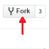

# put-your-project-name-here

A template Python project

## Setup Instructions

1. Fork this repository (by clicking this button in GitHub)

    

1. Rename your fork of this repository (e.g. to "my-project")

1. Clone your fork of this repository (e.g. `git clone https://github.com/your-username/my-project.git`) and `cd` into it

1. Create a virtual environment with `virtualenv venv` and activate it with `source venv/bin/activate`

1. Install the Python requirements with `pip install -r requirements.txt`

1. [optional] If you have Ruby, install markdownlint with `gem install mdl`

1. Check that all tests pass with `./run_tests.sh`

1. Read through [hello.py](hello.py), [test_hello.py](tests/test_hello.py), [smp.sh](script.sh), and [run_tests.sh](run_tests.sh), which are all brief but contain important extra info

## Development Instructions

As you develop your project, you might want to follow one of these two workflows

### Test-Driven Developement (TDD)

In test-driven development, you start by writing a failing test. Next, you make the test pass. Finally, you can refactor your code to improve the readability/speed/etc.

1. Add a new test in test_hello.py, which should fail at the moment (e.g. remove the `@unittest.skip` line in [test_hello.py](tests/test_hello.py))

    ```shell
    $ ./run_tests.sh
    ...
    AttributeError: module 'hello' has no attribute 'new_function'
    ...
    FAILED (errors=1)
    ```

1. Add/change code in hello.py so that the test will pass

1. Make sure all checks/tests in the project pass

    ```shell
    $ ./run_tests.sh
    ...
    Ran 2 tests in 0.000s

    OK
    ```

1. Add and commit your changes to Git with `git add .` followed by `git commit -m "my commit message"`

1. Push your changes to GitHub with `git push`

1. Run your experiment/analysis with `./script.sh`

### Retrospective Testing

As an alternative to TDD, you can write your code first and add your tests second. Below, we use a code coverage tool to see which parts of the codebase are not being tested.

1. Work on your code (e.g. in hello.py)

1. Run code coverage checks, to find lines that are not currently being tested

    ```shell
    $ ./run_tests.sh
    ...
    Name       Stmts   Miss  Cover   Missing
    ----------------------------------------
    hello.py      11      2    82%   10-11
    ----------------------------------------
    TOTAL         11      2    82%

    ```

1. Add a new test in [test_hello.py](tests/test_hello.py) to test your new work (e.g. remove the `@unittest.skip` line in test_hello.py)

1. Make sure all checks/tests in the project pass and test coverage is high enough

    ```shell
    $ ./run_tests.sh
    ...
    Name       Stmts   Miss  Cover   Missing
    ----------------------------------------
    hello.py      11      2    100%
    ----------------------------------------
    TOTAL         11      2    100%

    ```

1. Add and commit your changes to Git with `git add .` followed by `git commit -m "my commit message"`

1. Push your changes to GitHub with `git push`

1. Run your experiment/analysis with `script.sh`

## Finally

You can delete the [images/](images/) directory and all the text above, replacing it with information about your project.
